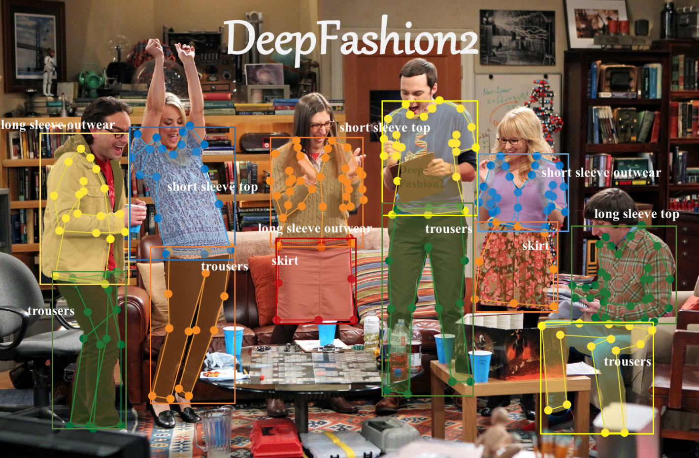

# Clothing Classification Fine-Tuning (DeepFashion2-300)

This repository contains an **end-to-end fine-tuning pipeline** for adapting a Vision Transformer (ViT) model to a **500-image subset of the [DeepFashion2](https://github.com/switchablenorms/DeepFashion2)** dataset.

It demonstrates how to:
- Load a pre-trained transformer backbone (`ViT-Base-Patch16-224`)
- Preprocess a custom subset of clothing images
- Fine-tune and evaluate a classifier
- Export model artifacts for deployment in a weather-aware clothing recommendation app.

---

## Overview

| Stage | Description |
|--------|-------------|
| **1. Dataset Preparation** | Selected ~300 cropped images from DeepFashion2 across 13 clothing categories (Dress, Outerwear, T-Shirt, Pants, etc.). |
| **2. Preprocessing** | Normalized and resized images to 224×224 with `AutoImageProcessor`, cropped using bounding boxes. |
| **3. Model** | Fine-tuned a pre-trained Vision Transformer (`vit-base-patch16-224-in21k` / `facebook/deit-base-patch16-224`) from ImageNet-21k weights. |
| **4. Training** | Used `Trainer` API for supervised fine-tuning with accuracy metric; trained for 5 epochs on 80/20 split. |
| **5. Saving** | Saved model weights (`model.safetensors`), processor config, and training arguments to `/final_model`. |

---

## Model Config
| Parameter         | Value                               |
| ----------------- | ----------------------------------- |
| **Base model**    | `google/vit-base-patch16-224-in21k` |
| **Framework**     | PyTorch + Hugging Face Transformers |
| **Classes**       | 13 (DeepFashion2 categories)        |
| **Dataset size**  | 300 images                          |
| **Optimizer**     | AdamW                               |
| **Learning rate** | 5e-5                                |
| **Batch size**    | 16                                  |
| **Epochs**        | 5                                   |
| **Eval metric**   | Accuracy (validation 20%)           |

